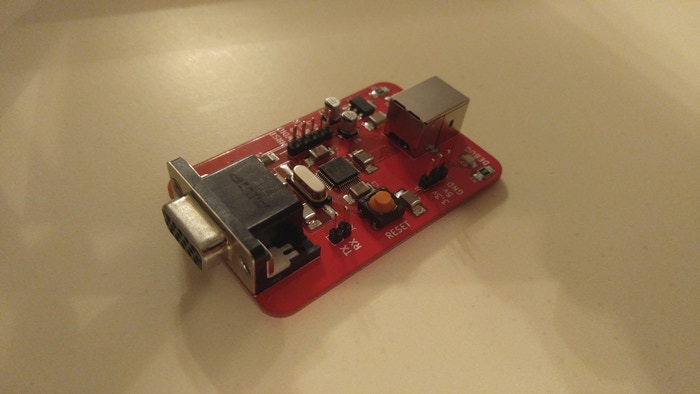
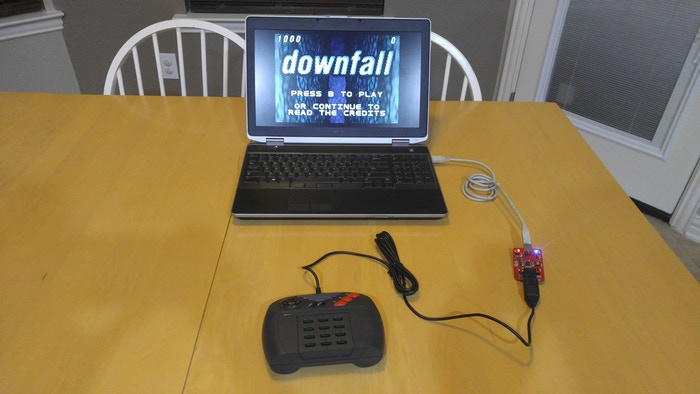
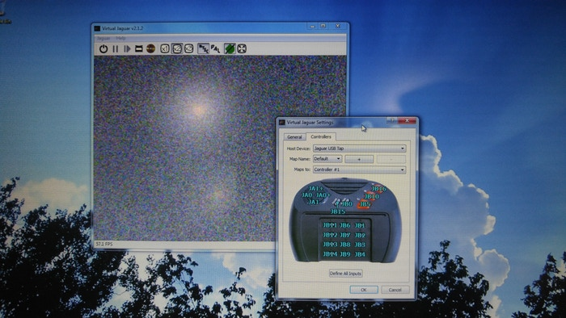

# Jaguar USB Tap


The [controller](https://atariage.com/controller_page.html?ControllerID=21&SystemID=JAGUAR) for the [Atari Jaguar](https://en.wikipedia.org/wiki/Atari_Jaguar) game console is a strange beast and doesn't map well to modern controllers (in large part due to the numeric keypad). This makes emulating games on a PC with off-the-shelf controllers, which usually mimic PlayStation or XBox layouts, somewhat cumbersome. One possible solution is to create a device which can convert the Jaguar controller's pinout and signals to a USB HID device.

## Hardware

The hardware was developed using the open-source schematic and PCB design tool [KiCad](http://kicad-pcb.org/). It sports an [STM32F070](http://www.st.com/en/microcontrollers/stm32f070cb.html) ARM Cortex M0 micro-controller which shall handle input from the Jaguar gamepad and generate appropriate USB HID signalling.







## Firmware

### Compatibility

I've tested on:

* Linux
* Windows 7
* MacOS X

In all cases the default USB HID driver on each system is suitable for use with the Jaguar USB Tap and enumerates correctly without additional drivers.

### Building

#### Prerequisites

Requires an ARM toolchain:

* arm-none-eabi-gcc
* arm-none-eabi-gdb
* arm-none-eabi-binutils
* OpenOCD (programming utility)

On Debian/Ubuntu: 

```
$ sudo apt-get install gcc-arm-none-eabi gdb-arm-none-eabi openocd
```
#### Make targets

To build the application:

```
$ make
```

To delete compiled objects and binaries:

```
$ make clean
```

To flash the STM32F0 over STLink:

```
$ make upload
```

To run the debugger, start an OpenOCD session with the target:

```
$ make debug
```

and then, in another terminal window:

```
$ make run_gdb
```
