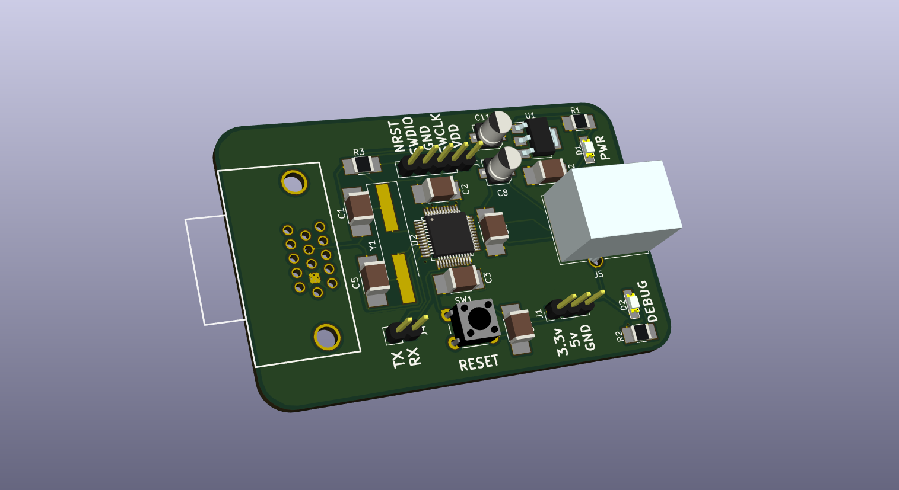

# Jaguar USB Tap

The [controller](https://atariage.com/controller_page.html?ControllerID=21&SystemID=JAGUAR) for the [Atari Jaguar](https://en.wikipedia.org/wiki/Atari_Jaguar) game console is a strange beast and doesn't map well to modern controllers (in large part due to the numeric keypad). This makes emulating games on a modern PC somewhat cumbersome. One possible solution is to create a device which can convert the Jaguar controller's pinout and signals to a modern USB HID device.

## Hardware

The hardware is developed using the open-source schematic and PCB design tool [KiCad](http://kicad-pcb.org/). It shall sport an [STM32F070](http://www.st.com/en/microcontrollers/stm32f070cb.html) ARM Cortex M0 micro-controller which shall handle input from the Jaguar gamepad and generate appropriate USB HID signalling.

